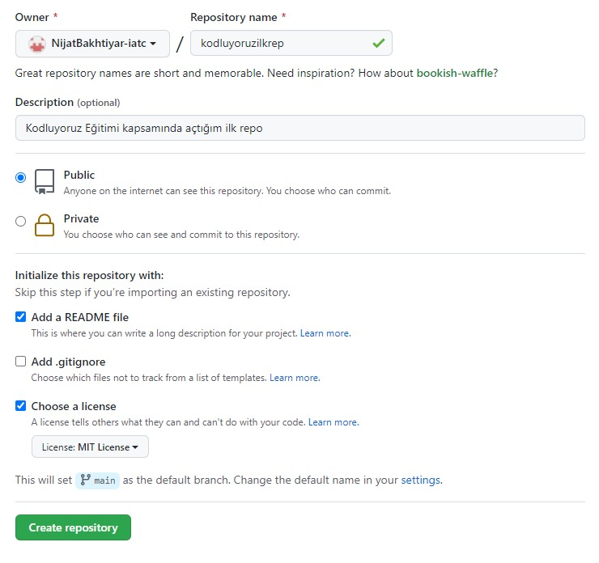

# kodluyoruzilkrepo

Bu repo [Kodluyoruz](https://www.kodluyoruz.org/) Front-End Eğitiminde oluşturduğmuz ilk repo.İçerisinde bir adet README dosyası, bir adet de index.html barındırıyor

<p>&nbsp;</p>



<p>&nbsp;</p>

# İnstallation

Öncelikle projeyi clonelayın

```
git clone https://github.com/cagllan/kodluyoruzilkrepo.git
```

<p>&nbsp;</p>

# Usage

Projeyi cloneladıktan sonra Visual Studio Code programında açınız.

Linux için:

```
cd kodluyoruzilkrepo
code .
```

<p>&nbsp;</p>

# Contributing

Pull requestler kabul edilir. Büyük değişiklikler için, lütfen önce neyi değiştirmek istediğinizi tartışmak için bir konu açınız.

<p>&nbsp;</p>

# Licence

[MIT](https://choosealicense.com/licenses/mit/)
